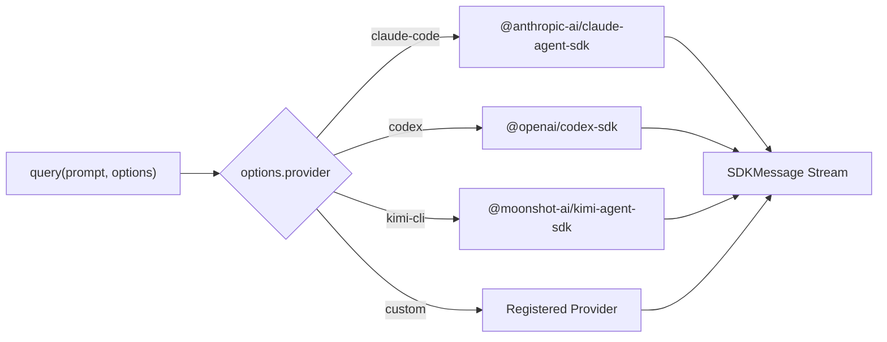

<div align="center">

<picture>
  
</picture>

<br />

[](https://www.npmjs.com/package/one-agent-sdk)
[](https://github.com/odysa/one-agent-sdk/actions/workflows/ci.yml)
[](https://www.typescriptlang.org/)
[](https://opensource.org/licenses/MIT)

**Drop-in replacement for `@anthropic-ai/claude-agent-sdk` — same API, multiple providers.**

<br />

[Getting Started](#getting-started) · [Features](#features) · [Providers](#supported-providers) · [API Reference](#api-reference) · [Examples](#examples)

<br />

</div>

```typescript
import { query, tool, createSdkMcpServer } from "one-agent-sdk";

// Same API as @anthropic-ai/claude-agent-sdk — swap provider with one option
const conversation = query({
  prompt: "What's the weather?",
  options: { provider: "codex" }, // "claude-code" (default) | "codex" | "kimi-cli"
});
```

<br />

## The Problem

`@anthropic-ai/claude-agent-sdk` has a great API — but it only works with Claude Code. If you want to use Codex or Kimi, you have to learn a completely different SDK.

## The Solution

One Agent SDK is a drop-in replacement for `@anthropic-ai/claude-agent-sdk` that routes to any backend. Same `query()`, `tool()`, `createSdkMcpServer()` — just pass `options.provider` to switch:

```diff
  const conversation = query({
    prompt: "Analyze this code",
-   options: { systemPrompt: "You are helpful." },
+   options: { systemPrompt: "You are helpful.", provider: "codex" },
  });
```

Everything else stays the same: streaming, tools, message format — all of it.

<br />

## Supported Providers

| Provider | Package | Agent Backend |
| :------- | :------ | :------------ |
| `claude-code` | [`@anthropic-ai/claude-agent-sdk`](https://www.npmjs.com/package/@anthropic-ai/claude-agent-sdk) | Claude Code |
| `codex` | [`@openai/codex-sdk`](https://www.npmjs.com/package/@openai/codex-sdk) | ChatGPT Codex |
| `kimi-cli` | [`@moonshot-ai/kimi-agent-sdk`](https://www.npmjs.com/package/@moonshot-ai/kimi-agent-sdk) | Kimi-CLI |
| `gemini-cli` | `@google/gemini-cli-core` | Gemini CLI (planned — pending stable SDK, see [#31](https://github.com/odysa/one-agent-sdk/issues/31)) |

All providers are **optional peer dependencies** — install only what you need. You can also [register custom providers](#custom-providers).

<br />

## Getting Started

### Prerequisites

- [Node.js](https://nodejs.org/) v18+ or [Bun](https://bun.sh/)
- At least one provider CLI installed and authenticated (e.g. Claude Code)

### Install

```bash
npm install one-agent-sdk
```

Then install your provider:

```bash
# Pick one (or more)
npm install @anthropic-ai/claude-agent-sdk
npm install @openai/codex-sdk
npm install @moonshot-ai/kimi-agent-sdk
```

### Quick Start

```typescript
import { z } from "zod";
import { query, tool, createSdkMcpServer } from "one-agent-sdk";

const weatherTool = tool(
  "get_weather",
  "Get the current weather for a city",
  { city: z.string().describe("City name") },
  async ({ city }) => ({
    content: [{ type: "text" as const, text: JSON.stringify({ city, temperature: 72, condition: "sunny" }) }],
  }),
);

const mcpServer = createSdkMcpServer({
  name: "tools",
  version: "1.0.0",
  tools: [weatherTool],
});

const conversation = query({
  prompt: "What's the weather in San Francisco?",
  options: {
    systemPrompt: "You are a helpful assistant. Use the weather tool when asked about weather.",
    mcpServers: { tools: mcpServer },
    allowedTools: ["mcp__tools__get_weather"],
  },
});

for await (const msg of conversation) {
  if (msg.type === "assistant" && msg.message?.content) {
    for (const block of msg.message.content) {
      if ("text" in block && block.text) process.stdout.write(block.text);
    }
  }
}
```

> [!TIP]
> To switch providers, add `provider: "codex"` or `provider: "kimi-cli"` to `options`. Defaults to `"claude-code"`.

<br />

## Features

### Multi-Provider Support

Same code, different backend — just change `options.provider`:

```typescript
import { query } from "one-agent-sdk";

// Use Claude (default)
const claude = query({ prompt: "Explain this code" });

// Use Codex
const codex = query({ prompt: "Explain this code", options: { provider: "codex" } });

// Use Kimi
const kimi = query({ prompt: "Explain this code", options: { provider: "kimi-cli" } });
```

The output stream always emits the same `SDKMessage` format, regardless of provider.

### Custom Providers

Register your own provider backend and use it with `query()`:

```typescript
import { registerProvider } from "one-agent-sdk";
import { query } from "one-agent-sdk";

registerProvider("my-llm", async (config) => ({
  async *run(prompt) {
    yield { type: "text", text: "Hello from my-llm!" };
    yield { type: "done" };
  },
  async *chat(msg) {
    yield { type: "text", text: msg };
    yield { type: "done" };
  },
  async close() {},
}));

const conversation = query({ prompt: "Hi", options: { provider: "my-llm" } });
```

<br />

## How It Works



- **`claude-code`** (default) — delegates directly to the real Anthropic SDK. Full fidelity, zero overhead.
- **`codex`** / **`kimi-cli`** / **custom** — routes to the backend and adapts the output to `SDKMessage` format.

> [!NOTE]
> Provider SDKs are dynamically imported at runtime — unused providers are never loaded.

<br />

## API Reference

```typescript
import { query, tool, createSdkMcpServer } from "one-agent-sdk";
```

100% API-compatible with `@anthropic-ai/claude-agent-sdk`. All exports are identical — see the [Anthropic Agent SDK docs](https://www.npmjs.com/package/@anthropic-ai/claude-agent-sdk) for the full reference.

**Added by One Agent SDK:**

| Option | Description |
| :------- | :---------- |
| `options.provider` | Route to a different backend: `"claude-code"` (default), `"codex"`, `"kimi-cli"`, or any registered custom provider |

| Helper | Description |
| :------- | :---------- |
| `registerProvider(name, factory)` | Register a custom provider backend (import from `one-agent-sdk`) |

For full API documentation, see the [docs site](https://odysa.github.io/one-agent-sdk/).

<br />

## Examples

The [`examples/`](./examples) directory contains runnable demos:

| Example | Description |
| :------ | :---------- |
| [`claude.ts`](./examples/claude.ts) | Claude with tools via `query()` + `tool()` |
| [`codex.ts`](./examples/codex.ts) | Codex backend |
| [`kimi.ts`](./examples/kimi.ts) | Kimi backend |
| [`hello.ts`](./examples/hello.ts) | Minimal example (legacy API) |
| [`multi-agent.ts`](./examples/multi-agent.ts) | Multi-agent handoffs (legacy API) |

```bash
npx tsx examples/hello.ts
```

<br />

## Legacy API (Deprecated)

The following functions are exported from `one-agent-sdk` and will be removed in v0.2. Migrate to `one-agent-sdk` instead.

| Function | Replacement |
| :------- | :---------- |
| `run(prompt, config)` | `query({ prompt, options })` |
| `runToCompletion(prompt, config)` | `query({ prompt, options })` + collect results |
| `defineAgent({...})` | Pass agent config directly via `query()` options |
| `defineTool({...})` | `tool(name, description, schema, handler)` |

<br />

## Contributing

Contributions are welcome! Please see the [contributing guide](CONTRIBUTING.md) for details.

<br />

## License

[MIT](LICENSE)
