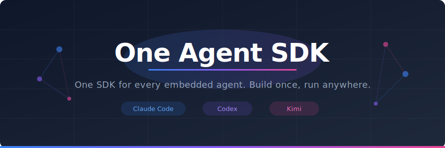
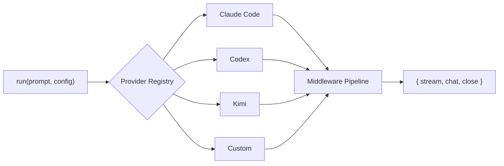

<div align="center">

<picture>
  
</picture>

<br />

[](https://www.npmjs.com/package/one-agent-sdk)
[](https://github.com/odysa/one-agent-sdk/actions/workflows/ci.yml)
[](https://www.typescriptlang.org/)
[](https://opensource.org/licenses/MIT)

**One SDK, every agent.** Embed Claude Code, Codex, and Kimi into your TypeScript app — no API keys required.

<br />

[Getting Started](#getting-started) · [Features](#features) · [Providers](#supported-providers) · [API Reference](#api-reference) · [Examples](#examples)

<br />

</div>

```typescript
import { defineAgent, defineTool, run } from "one-agent-sdk";

const { stream } = await run("What's the weather?", {
  provider: "claude-code",  // swap to "codex" or "kimi-cli" — same code, different backend
  agent,
});
```

<br />

## The Problem

Every LLM provider ships its own SDK with different streaming formats, tool-calling APIs, and agent patterns. You end up rewriting the same logic for each backend.

## The Solution

One Agent SDK gives you a single, provider-agnostic interface. Write your agents, tools, and orchestration once — then swap backends by changing one string:

```diff
  const { stream } = await run("Analyze this code", {
-   provider: "claude-code",
+   provider: "codex",
    agent,
  });
```

Everything else stays the same: streaming, tools, handoffs, middleware — all of it.

<br />

## Supported Providers

| Provider | Package | Agent Backend |
| :------- | :------ | :------------ |
| `claude-code` | [`@anthropic-ai/claude-agent-sdk`](https://www.npmjs.com/package/@anthropic-ai/claude-agent-sdk) | Claude Code |
| `codex` | [`@openai/codex-sdk`](https://www.npmjs.com/package/@openai/codex-sdk) | ChatGPT Codex |
| `kimi-cli` | [`@moonshot-ai/kimi-agent-sdk`](https://www.npmjs.com/package/@moonshot-ai/kimi-agent-sdk) | Kimi-CLI |
| `gemini-cli` | `@google/gemini-cli-core` | Gemini CLI (planned — pending stable SDK, see [#31](https://github.com/odysa/one-agent-sdk/issues/31)) |

All providers are **optional peer dependencies** — install only what you need. You can also [register custom providers](#custom-providers).

<br />

## Getting Started

### Prerequisites

- [Node.js](https://nodejs.org/) v18+ or [Bun](https://bun.sh/)
- At least one provider CLI installed and authenticated (e.g. Claude Code)

### Install

```bash
npm install one-agent-sdk
```

Then install your provider:

```bash
# Pick one (or more)
npm install @anthropic-ai/claude-agent-sdk
npm install @openai/codex-sdk
npm install @moonshot-ai/kimi-agent-sdk
```

### Quick Start

```typescript
import { z } from "zod";
import { defineAgent, defineTool, run } from "one-agent-sdk";

// Define a tool with Zod — type-safe across all providers
const weatherTool = defineTool({
  name: "get_weather",
  description: "Get the current weather for a city",
  parameters: z.object({
    city: z.string().describe("City name"),
  }),
  handler: async ({ city }) => {
    return JSON.stringify({ city, temperature: 72, condition: "sunny" });
  },
});

// Define an agent
const agent = defineAgent({
  name: "assistant",
  description: "A helpful assistant",
  prompt: "You are a helpful assistant.",
  tools: [weatherTool],
});

// Run it
const { stream } = await run("What's the weather in San Francisco?", {
  provider: "claude-code",
  agent,
});

for await (const chunk of stream) {
  if (chunk.type === "text") process.stdout.write(chunk.text);
}
```

> [!TIP]
> To switch providers, just change `provider: "claude-code"` to `"codex"` or `"kimi-cli"`. Everything else stays the same.

<br />

## Features

### Multi-Agent Handoffs

Agents hand off tasks to each other seamlessly. Define who can talk to whom — the SDK handles routing across all providers.

```typescript
const researcher = defineAgent({
  name: "researcher",
  description: "Searches the web",
  prompt: "You are a research assistant. Hand off to math for calculations.",
  tools: [searchTool],
  handoffs: ["math"],
});

const math = defineAgent({
  name: "math",
  description: "Evaluates expressions",
  prompt: "You are a math assistant.",
  tools: [calculatorTool],
  handoffs: ["researcher"],
});

const { stream } = await run("Population of Tokyo? Then calculate 15% of it.", {
  provider: "claude-code",
  agent: researcher,
  agents: { researcher, math },
});

for await (const chunk of stream) {
  if (chunk.type === "text") process.stdout.write(chunk.text);
  if (chunk.type === "handoff") console.log(`\n${chunk.fromAgent} -> ${chunk.toAgent}`);
}
```

### Structured Output

Validate agent responses against Zod schemas with `runToCompletion`:

```typescript
import { z } from "zod";
import { runToCompletion } from "one-agent-sdk";

const City = z.object({
  name: z.string(),
  country: z.string(),
  population: z.number(),
});

const city = await runToCompletion("Give me info about Tokyo as JSON.", {
  provider: "claude-code",
  agent,
  responseSchema: City,
});
// city is typed as { name: string; country: string; population: number }
```

### Sessions

Multi-turn conversation history with pluggable storage:

```typescript
import { createSession } from "one-agent-sdk";

const session = createSession();

const first = await session.run("My name is Alice.", { provider: "claude-code", agent });
for await (const chunk of first.stream) { /* ... */ }

// The agent remembers the previous turn
const second = await session.run("What's my name?", { provider: "claude-code", agent });
for await (const chunk of second.stream) { /* ... */ }
```

Implement the `SessionStore` interface to persist history to a database or file system.

### Middleware

Composable stream transformations between the provider and your application:

```typescript
import { defineMiddleware, run } from "one-agent-sdk";

const logger = defineMiddleware(async function* (stream, context) {
  for await (const chunk of stream) {
    if (chunk.type === "text") console.log(`[${context.provider}]`, chunk.text);
    yield chunk;
  }
});

const { stream } = await run("Hello", {
  provider: "claude-code",
  agent,
  middleware: [logger],
});
```

The SDK ships with built-in middleware for logging, usage tracking, timing, text collection, guardrails, hooks, and filtering.

### Custom Providers

Register your own provider backend:

```typescript
import { registerProvider, run } from "one-agent-sdk";

registerProvider("my-llm", async (config) => ({
  async *run(prompt) {
    yield { type: "text", text: "Hello from my-llm!" };
    yield { type: "done" };
  },
  async *chat(msg) {
    yield { type: "text", text: msg };
    yield { type: "done" };
  },
  async close() {},
}));

const { stream } = await run("Hi", { provider: "my-llm", agent });
```

<br />

## How It Works



Each provider adapts its native SDK to a unified `StreamChunk` interface:

- **Claude Code** — wraps the Claude Agent SDK. Tools are exposed via an in-process MCP server.
- **Codex** — wraps the Codex SDK. Zod schemas are converted to JSON Schema automatically.
- **Kimi** — wraps the Kimi Agent SDK. Uses `createSession`/`createExternalTool`.

> [!NOTE]
> Provider SDKs are dynamically imported at runtime — unused providers are never loaded.

<br />

## Stream Events

All providers emit the same `StreamChunk` discriminated union:

| Type | Fields | Description |
| :--- | :----- | :---------- |
| `text` | `text` | Generated text delta |
| `tool_call` | `toolName`, `toolArgs`, `toolCallId` | Agent is calling a tool |
| `tool_result` | `toolCallId`, `result` | Tool returned a result |
| `handoff` | `fromAgent`, `toAgent` | Agent handoff occurred |
| `error` | `error` | Something went wrong |
| `done` | `text?`, `usage?` | Run completed |

<br />

## API Reference

| Function | Description |
| :------- | :---------- |
| `run(prompt, config)` | Start a streaming agent run. Returns `{ stream, chat, close }` |
| `runToCompletion(prompt, config)` | Run and return the final text (or validated object with `responseSchema`) |
| `defineAgent({...})` | Define an agent with prompt, tools, and handoffs |
| `defineTool({...})` | Define a type-safe tool with Zod schema |
| `defineMiddleware(fn)` | Create a stream middleware |
| `createSession(config?)` | Create a session for multi-turn conversations |
| `registerProvider(name, factory)` | Register a custom provider backend |

`run()` returns an `AgentRun` handle:

- **`stream`** — `AsyncGenerator<StreamChunk>` yielding events as they happen
- **`chat(message)`** — send a follow-up message, returns a new stream
- **`close()`** — clean up resources

For full API documentation, see the [docs site](https://odysa.github.io/one-agent-sdk/).

<br />

## Examples

The [`examples/`](./examples) directory contains runnable demos:

| Example | Description |
| :------ | :---------- |
| [`hello.ts`](./examples/hello.ts) | Minimal agent, no tools |
| [`multi-agent.ts`](./examples/multi-agent.ts) | Two agents handing off to each other |
| [`claude.ts`](./examples/claude.ts) | Claude-specific example |
| [`codex.ts`](./examples/codex.ts) | Codex-specific example |
| [`kimi.ts`](./examples/kimi.ts) | Kimi-specific example |

```bash
npx tsx examples/hello.ts
```

<br />

## Contributing

Contributions are welcome! Please see the [contributing guide](CONTRIBUTING.md) for details.

<br />

## License

[MIT](LICENSE)
